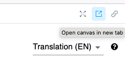

[](https://zenodo.org/badge/latestdoi/574677398)

# editioncrafter
Software for the development of EditionCrafter, digital critical edition publication tool

EditionCrafter can be included in a React app or a HTML website. EditionCrafter should work on any content management system (CMS) where you can edit the HTML of your page. We have tested it on Hugo CMS, Astro Framework, and Scalar CMS. We also have an example Hugo website that you can fork. Please see that website's [README](https://github.com/cu-mkp/editioncrafter-project) for more information.

## EditionCrafter in a React App

If you are including EditionCrafter in a React app, add this module to your project:

```
npm add @cu-mkp/editioncrafter
```

The reference section below details all of the props of the EditionCrafter component. Here is an example of use:

```jsx
import EditionCrafter from '@cu-mkp/editioncrafter'

<EditionCrafter
  documentName='BnF Ms. Fr. 640'
  transcriptionTypes={{
    tc: 'Diplomatic (FR)',
    tcn: 'Normalized (FR)',
    tl: 'Translation (EN)'
  }}
  iiifManifest='https://cu-mkp.github.io/editioncrafter-data/fr640_3r-3v-example/iiif/manifest.json'
  glossaryURL='https://cu-mkp.github.io/editioncrafter-data/fr640_3r-3v-example/glossary.json'
/>
```

## EditionCrafter in an HTML Website

To include EditionCrafter in your HTML website, you need to create a `div` somewhere on your page, assign it an ID and then pass that ID to EditionCrafter. The reference section details the options for EditionCrafter, which are otherwise the same as the React component. Here is an example of use:

```html
 <div id="ec"></div>

 <script type="text/javascript" src="https://www.unpkg.com/@cu-mkp/editioncrafter-umd" ></script>

 <script type="text/javascript">

     EditionCrafter.viewer({
         id: 'ec',
         documentName: 'BnF Ms. Fr. 640',
         iiifManifest: 'https://cu-mkp.github.io/editioncrafter-data/fr640_3r-3v-example/iiif/manifest.json',
         glossaryURL: 'https://cu-mkp.github.io/editioncrafter-data/fr640_3r-3v-example/glossary.json',
         transcriptionTypes: {
           tc: 'Diplomatic (FR)',
           tcn: 'Normalized (FR)',
           tl: 'Translation (EN)'
         }
     });

 </script>
```

## EditionCrafter Viewer Reference

The following props are available to the `<EditionCrafter>` viewer component:

### documentInfo

Optional; used **only** in the case that you wish to load multiple documents in the same viewer for easy comparison. 

An *object* whose keys are unique document IDs for each document you wish to include, and whose values are *objects* specifying the `documentName`, `transcriptionTypes`, and `iiifManifest` for each document as described below. For example:
```js
documentInfo={{
    FHL_007548733_TAOS_BAPTISMS_BATCH_2: {
        documentName: 'Taos Baptisms Batch 2',
        transcriptionTypes: {
            translation: 'Translation',
            transcription: 'Transcription',
        },
        iiifManifest: 'https://cu-mkp.github.io/editioncrafter/taos-baptisms-example/iiif/manifest.json',
    },
    eng_415_145a: {
        documentName: 'Eng 415-145a',
        transcriptionTypes: {
            'eng-415-145a': 'Transcription',
        },
        iiifManifest: 'https://cu-mkp.github.io/bic-editioncrafter-data/eng-415-145a/iiif/manifest.json',
    }
}}
```

### documentName

Required. (Note: This is required even in the case that you have also included a `documentInfo` prop.)

A *string* giving the name of the document(s). 

### glossaryURL

Optional. A URL pointing to a JSON file containing glossary information. The glossary should have the following format:
```
{
  "title": "[a subheader, written in markdown]",
  "citation": "[information on how to cite the glossary, written in markdown]",
  "entries": {
    "[Term]": {
      "headword": "...",
      "alternateSpellings": "...",
      "meanings": [
        {
          "partOfSpeech": "...",
          "meaning": "...",
          "references": "..."
        }
        ...
      ],
      "modernSpelling: "...",
      "antonym": "...",
      "synonym": "...",
      "seeAlso": "..."
    },
    ...
  }
}
```

### iiifManifest

Required if no `documentInfo` prop specified.

The URL of the IIIF manifest for your document.

### threePanel

Optional. (Defaults to `false`.)

A *boolean* flag, which when set to `true` adds a third pane to the viewer. The third pane starts collapsed on the righthand side of the viewer and can be expanded by clicking and dragging the divider. This pane operates independently from the other throw; for example Book Mode is disabled in the third pane.

### transcriptionTypes

Required if no `documentInfo` prop specified.

An *object* providing a dictionary of the different transciption types provided in your TEI document. The keys of this object should correspond to the `xml:id` values of the different `<text>` layers of your document. For example, suppose you have the following text layers in your document:

```xml
<text xml:id="transcription">

  ... my transcription ...

</text>

<text xml:id="translation">

  ... my translation ...

</text>
```
In this case the `transcriptionTypes` object might have the form:

```js
transcriptionTypes = {
    transcription: 'Transcription',
    translation: 'Translation'
}
```
The value for each transcription type should be a string that will be displayed in the selection menu within the viewer. These need not correspond precisely to the keys. For instance in the example above, you could add more information to the display strings, e.g. `'Transcription (FR)'` and `Translation (EN)`.

## Structure of this repository

There are two apps in this repo. `editioncrafter` is a React component, while `editioncrafter-umd` wraps the React component into a UMD module for use on non-React pages.

## Storybook

For local development, you can use the Storybook component.

Setup for Storybook was kind of rushed and the process could still be made simpler.

1. Clone the [`edition-crafter-cli`](https://github.com/cu-mkp/editioncrafter-cli) repository if you haven't already, do the usual `npm install`, and run `npm start` to launch a server with a test document.
2. Back here in `editioncrafter`, run `npm run storybook` to launch Storybook. You'll see a component called EditionCrafter in the sidebar, and it should be all set to try.

By default, Storybook doesn't display the hash routing params used by `react-router`. You can use the "Open canvas in new tab" button on the top right to open the component in its own tab:


